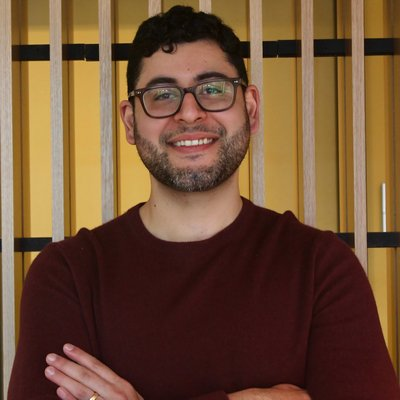
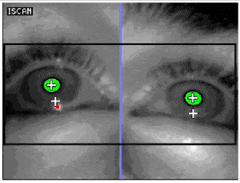

Interested in working together? Reach out:

<a href="mailto:mmarte1@jh.edu" title="Email"><i class="fas fa-envelope"></i></a>
<a href="https://orcid.org/0000-0002-1837-601X" title="ORCID"><i class="ai ai-orcid"></i></a>
<a href="https://scholar.google.com/citations?user=R3M1K-MAAAAJ" title="Google Scholar"><i class="ai ai-google-scholar"></i></a>
<a href="https://bsky.app/profile/mjm.bsky.social" title="Bluesky"><i class="fa-brands fa-bluesky"></i></a>
<a href="https://twitter.com/manueljmarte" title="Twitter / X"><i class="fa-brands fa-x-twitter"></i></a>

Few human capacities are as defining as language, and few losses are more devastating than when neurological injury impairs it. My research aims to advance our understanding of these disorders and improve their assessment, prognosis, and treatment.

I am a Postdoctoral Research Fellow with Dr. [Argye E. Hillis](https://score.jhmi.edu/director.html) in the [SCORE Lab](https://score.jhmi.edu/index.html) ([Department of Neurology](https://www.hopkinsmedicine.org/neurology-neurosurgery), Johns Hopkins University). Here, I apply machine learning and large language models to study how post-stroke recovery unfolds and to analyze connected speech rigorously and at scale. As a multilingual researcher, I am also drawn to how our theories of language disorders can better reflect the diversity of human linguistic experience.

I completed my Ph.D. in [Speech, Language & Hearing Sciences](https://www.bu.edu/sargent/academics/departments-programs/speech-language-hearing-sciences/phd-in-slhs/), working with Dr. [Swathi Kiran](https://www.bu.edu/sargent/profile/swathi-kiran-ph-d-ccc-slp/) ([Center for Brain Recovery](https://www.bu.edu/cbr/), Boston University) and Dr. [Einat Liebenthal](https://www.mcleanhospital.org/profile/einat-liebenthal) ([Institute for Technology in Psychiatry](https://bakerlab.mclean.harvard.edu/institute-for-technology-in-psychiatry/), McLean Hospital, Harvard Medical School). Previously, I worked as a speech-language pathologist specializing in TBI and stroke neurorehabilitation at the [Northeast Center for Brain Injury and Rehabilitation](https://www.northeastcenter.com). I hold an M.S. from [SUNY New Paltz](https://www.newpaltz.edu/commdis/) and a B.A. from the [University at Buffalo](https://arts-sciences.buffalo.edu/cds.html).

When I am not working, I am spending time with my family, shooting hoops, and [reading](https://oku.club/user/mjm).
